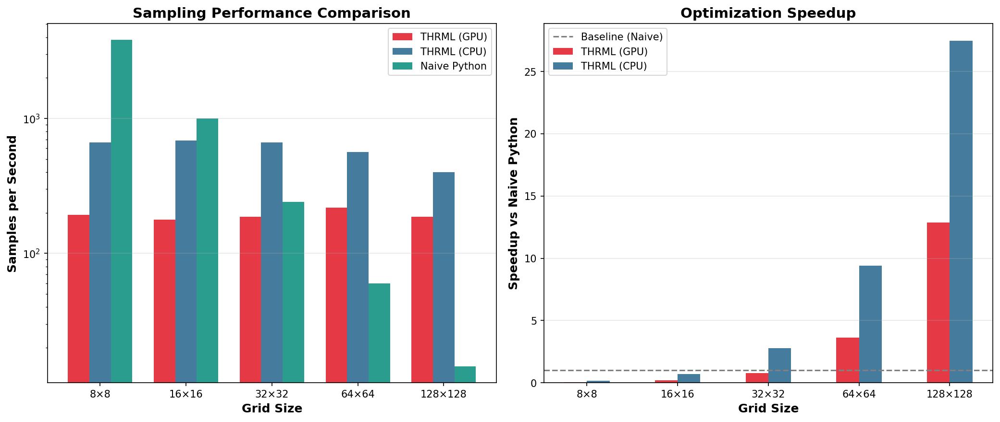

# Extropic THRML Experiments

Hands-on exploration of Extropic's thermodynamic computing library and probabilistic graphical models.

## 📚 Documentation
- **[Extropic_Knowledge_Base.md](./Extropic_Knowledge_Base.md)** - Comprehensive overview of Extropic's technology, hardware, and algorithms

## 🎯 Project Ideas

### 1. Ising Model Phase Transition Explorer ⭐
**Status**: ✅ Complete  
**Difficulty**: Beginner-friendly  
**Directory**: `./01_ising_phase_transitions/`

**Goal**: Build an interactive visualization of 2D Ising model phase transitions

**Completed Features**:
- ✅ Visualize magnetic spin systems on 2D lattices (`ising_animated.py`)
- ✅ Sweep temperature parameter to observe spontaneous magnetization (`phase_transition.py`)
- ✅ Animate block Gibbs sampling in real-time (`ising_animated.py`)
- ✅ Compare different graph colorings and block structures (`block_comparison.py`)
- ✅ Benchmark sampling speed vs naive methods (`benchmark.py`)

**Scripts**:
- `ising_basic.py` - Simple 1D chain introduction
- `ising_interactive.py` - Web interface for parameter exploration
- `ising_animated.py` - Visual 2D grid with spin evolution
- `phase_transition.py` - Temperature sweep to find critical point
- `block_comparison.py` - Compare 2-coloring vs 4-coloring strategies
- `benchmark.py` - Speed comparison: GPU vs CPU vs naive Python

**Learning Outcomes**:
- ✅ Understand block Gibbs sampling fundamentals
- ✅ See how TSU-style hardware would accelerate sampling
- ✅ Build intuition for energy-based models
- ✅ Classic statistical physics meets modern ML

**🔬 Benchmark Results**:

We ran comprehensive performance tests comparing THRML (GPU/CPU) against naive Python implementations. Here's what we found:

| Grid Size | Naive Python | THRML CPU | THRML GPU | Winner |
|-----------|--------------|-----------|-----------|---------|
| 8×8 | **3823 s/s** | 662 s/s | 193 s/s | Naive (overhead dominates) |
| 16×16 | **1003 s/s** | 685 s/s | 178 s/s | Naive (still too small) |
| **32×32** | 241 s/s | **665 s/s** | 187 s/s | **THRML wins! ✨** |
| 64×64 | 60 s/s | **564 s/s** | 218 s/s | THRML (9.4x faster) |
| 128×128 | 15 s/s | **400 s/s** | 188 s/s | THRML (27x faster) |

**Key Findings**:
- 📍 **Crossover point: ~500 spins** (between 16×16 and 32×32)
- 🐌 Below this: naive Python wins due to JAX/GPU overhead
- 🚀 Above this: THRML's vectorization dominates (scales much better)
- 🤔 GPU surprisingly slower than CPU for these sizes (memory transfer overhead)
- 💡 Extropic's 10,000x claims target problems with **millions** of variables, not hundreds



**Try it yourself**:
```bash
cd 01_ising_phase_transitions
python benchmark.py
```

**Challenge**: Can you find ways to make THRML faster? Ideas:
- Better JIT warmup strategies
- Optimize batch sizes
- Test larger grids (256×256, 512×512)
- Try different blocking strategies
- Profile memory vs compute bottlenecks

---

### 2. Energy-Based Generative Model on MNIST 🎨
**Status**: 📋 Planned  
**Difficulty**: Intermediate  
**Directory**: `./02_ebm_mnist_generation/`

**Goal**: Train and sample from an EBM to generate handwritten digits

**Features**:
- Train EBM on MNIST or Fashion-MNIST dataset
- Sample new images using THRML
- Visualize energy landscape and sampling trajectories
- Benchmark against VAE/diffusion baselines
- Attempt to reproduce Extropic's 10,000x efficiency claims

**Learning Outcomes**:
- Hands-on with energy-based generative models
- Test claims about sampling efficiency
- Compare EBMs vs current SOTA architectures
- Understand training challenges for EBMs

---

### 3. Probabilistic Constraint Satisfaction Solver 🧩
**Status**: 💡 Future  
**Difficulty**: Advanced  
**Directory**: `./03_constraint_satisfaction/`

**Goal**: Map combinatorial optimization problems to Ising models and solve with Gibbs sampling

**Features**:
- Implement Sudoku, graph coloring, or scheduling problems
- Map constraints to Ising/Potts model energy functions
- Use THRML sampling to find solutions
- Compare vs traditional SAT/CSP solvers
- Visualize solution space exploration

**Learning Outcomes**:
- Non-ML applications of probabilistic computing
- When is Gibbs sampling competitive with other methods?
- Problem formulation for thermodynamic hardware
- Understand TSU applicability beyond AI

---

## 🛠️ Setup

```bash
# Create virtual environment
python3 -m venv .venv
source .venv/bin/activate

# Install THRML and dependencies
pip install thrml jax jaxlib matplotlib numpy

# For CUDA support (optional, if you have NVIDIA GPU)
pip install --upgrade "jax[cuda12]"
```

## 📖 Resources

- **THRML GitHub**: https://github.com/extropic-ai/thrml
- **Documentation**: https://docs.thrml.ai
- **Extropic Website**: https://extropic.ai
- **Paper (DTMs)**: https://extropic.ai/dtms

## 🧪 Experimental Philosophy

This workspace is about **hands-on validation** of Extropic's claims:
- Does block Gibbs sampling actually provide speedups?
- Are EBMs competitive with modern architectures?
- Where does thermodynamic computing shine vs struggle?
- Can we reproduce their published results?

Approach with curiosity and healthy skepticism! 🔬
